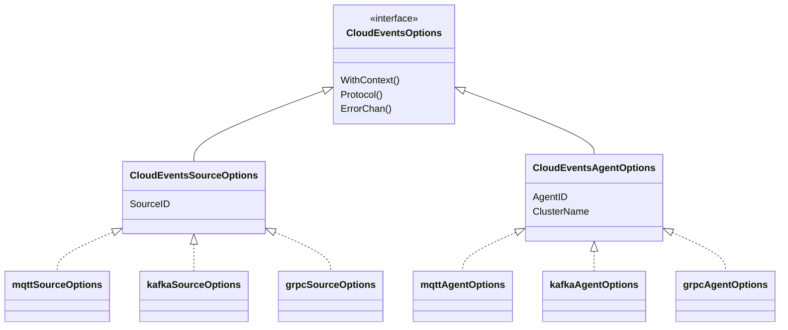
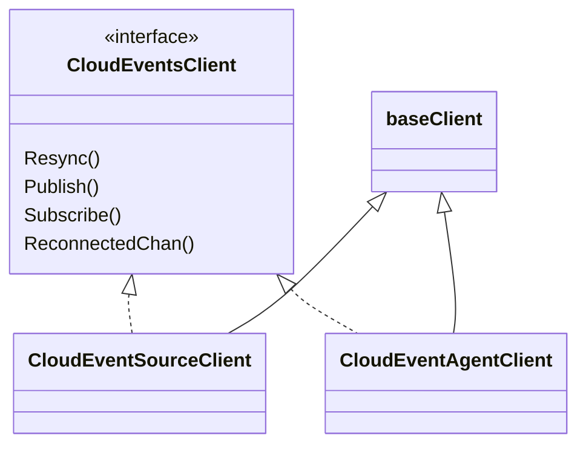
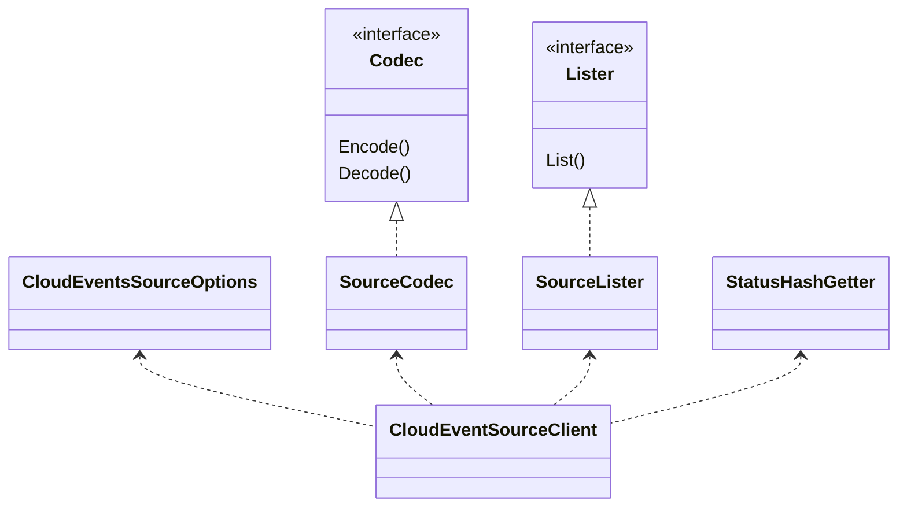
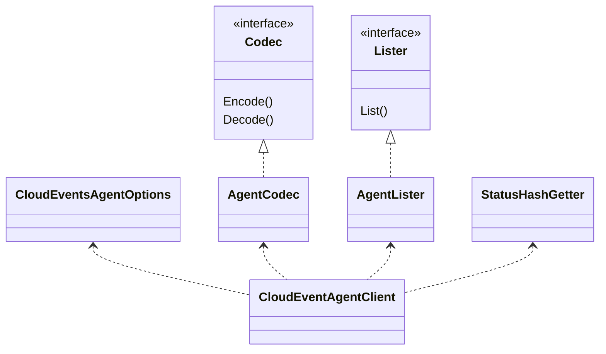
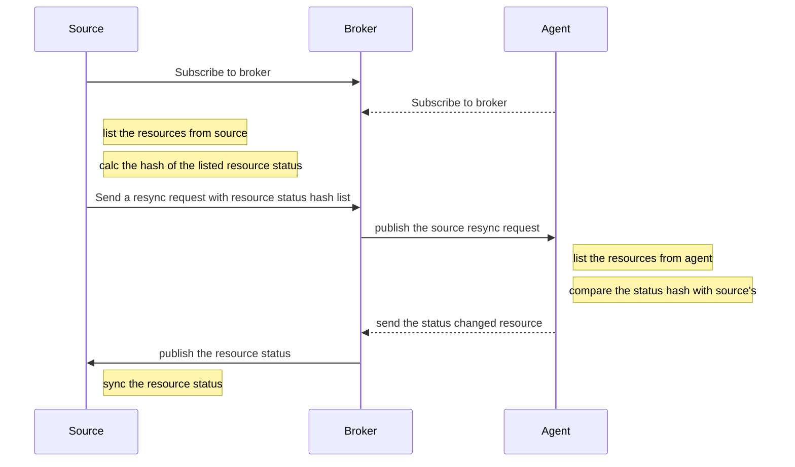
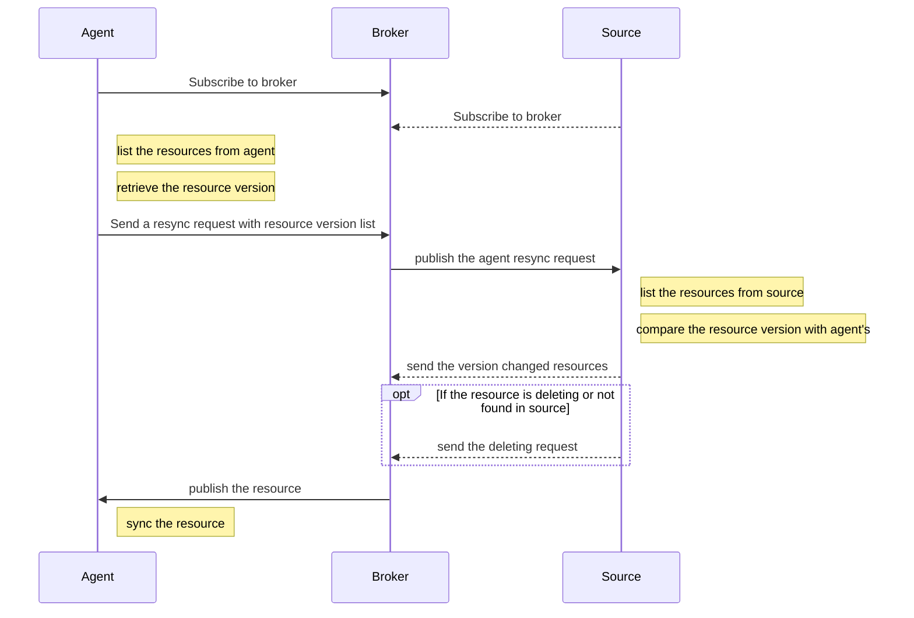
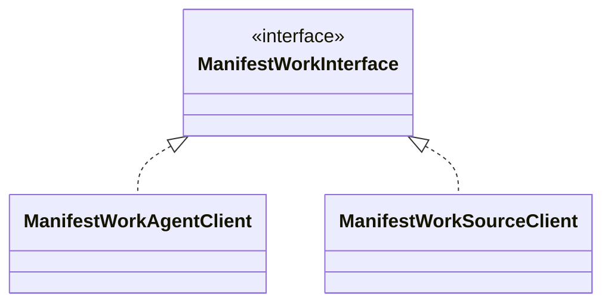
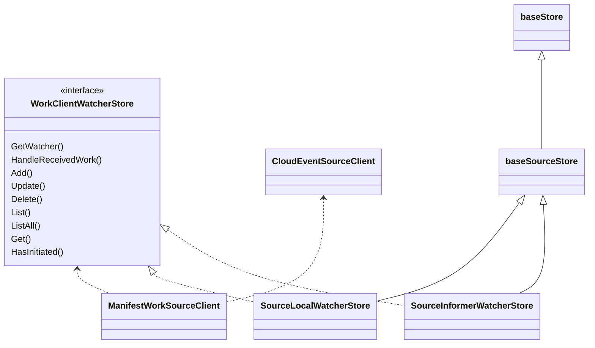
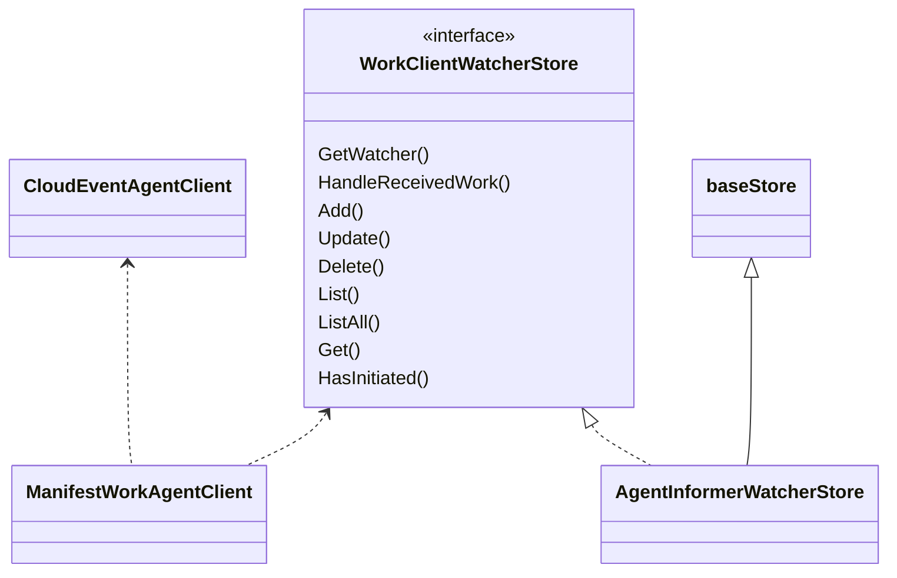
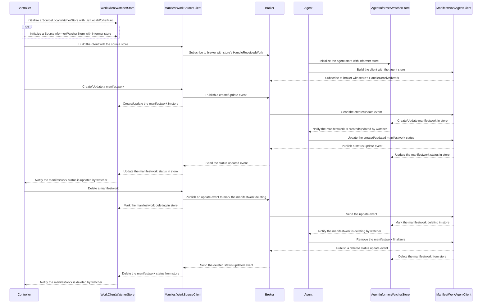

# Design Doc

## Overview

There two types of client implementations in the `cloudevents` directory.

- In `generic` directory, there are two clients [`CloudEventSourceClient`](../generic/sourceclient.go) and [`CloudEventAgentClient`](../generic/agentclient.go), they implement the [`CloudEventsClient`](../generic/interface.go) interface to resync/publish/subscribe [`ResourceObject`](../generic/interface.go) between sources and agents with cloudevents.
- In `work` directory, there are two clients [`ManifestWorkSourceClient`](../work/source/client/manifestwork.go) and [`ManifestWorkAgentClient`](../work/agent/client/manifestwork.go), they are based on [`CloudEventSourceClient`](../generic/sourceclient.go) and [`CloudEventAgentClient`](../generic/agentclient.go) to implement the [`ManifestWorkInterface`](https://github.com/open-cluster-management-io/api/blob/main/client/work/clientset/versioned/typed/work/v1/manifestwork.go#L24), these clients are used for applying `ManifestWork` and retrieving `ManifestWork` status between source and work agent.

## Generic CloudEvents Clients

### CloudEventsOptions Interface

The [`CloudEventsOptions`](../generic/options/options.go) interface defines an option that provides cloudevents protocol to send/receive cloudevents based on different event protocol.

For each event protocol, it needs to implement the `CloudEventsSourceOptions` and `CloudEventsAgentOptions`, the 
`CloudEventsSourceOptions` will be used for building cloudevents source client and the `CloudEventsAgentOptions` will be used for building cloudevents agent client.

Currently, the MQTT, Kafka and gRPC are implemented.

### CloudEventsClient Interface

The [`CloudEventsClient`](../generic/interface.go) interface defines a client that resync/publish/subscribe [`ResourceObject`](../generic/interface.go) between sources and agents with cloudevents, the [`ResourceObject`](../generic/interface.go) interface defines an object that can be published/subscribed by `CloudEventsClient`.

The [`CloudEventSourceClient`](../generic/sourceclient.go) and [`CloudEventAgentClient`](../generic/agentclient.go) implement the `CloudEventsClient` interface for source and agent.

These two clients are based on [`baseClient`](../generic/baseclient.go), the `baseClient` use the given `CloudEventsOptions` to build cloudevents client to publish/subscribe resources and handle the cloudevents client reconnect, when the cloudevents client reconnect happened, the `baseClient` will send a signal to the reconnect channel.

The `CloudEventSourceClient` depends on the following objects

- A `CloudEventsSourceOptions`, it provides a cloudevents protocol that will be used by `CloudEventSourceClient` to build the cloudevent client.
- A lister that implements the [`Lister`](../generic/interface.go) interface, it is used to list the `ResourceObject` that are maintained by source when resync happens.
- A `StatusHashGetter` function, it is used to calculate the hash of resource status, this function will be invoked when a source client send resync request to agent.
- Codecs that implements the [`Codec`](../generic/interface.go) interface, they are used to encode/decode the `ResourceObject`/`cloudevents.Event` to `cloudevents.Event`/`ResourceObject`.

The `CloudEventAgentClient` depends on the following objects

- A `CloudEventsAgentOptions`, it provides a cloudevents protocol that will be used by `CloudEventAgentClient` to build the cloudevent client.
- A lister that implements the [`Lister`](../generic/interface.go) interface, it is used to list the `ResourceObject` that are maintained by agent when resync happens.
- A `StatusHashGetter` function, it is used to calculate the hash of resource status, this function will be invoked when an agent client responses the source resync request.
- Codecs that implements the [`Codec`](../generic/interface.go) interface, they are used to encode/decode the `ResourceObject`/`cloudevents.Event` to `cloudevents.Event`/`ResourceObject`.

**Note**: to resync the resource status, the `StatusHashGetter` function should be same for `CloudEventSourceClient` and `CloudEventAgentClient`

#### CloudEventsClient Resync Resources

1. source resync resource status from agent

2. agent resync resource from source

## ManifestWork CloudEvents Clients

There are two clients [`ManifestWorkSourceClient`](../work/source/client/manifestwork.go) and [`ManifestWorkAgentClient`](../work/agent/client/manifestwork.go), both of them implement the [`ManifestWorkInterface`](https://github.com/open-cluster-management-io/api/blob/main/client/work/clientset/versioned/typed/work/v1/manifestwork.go#L24).

### ManifestWorkSourceClient

The `ManifestWorkSourceClient` is used for source part, it depends on [`CloudEventSourceClient`](../generic/sourceclient.go) and [`WorkClientWatcherStore`](../work/store/interface.go).

The `ManifestWorkSourceClient` uses `CloudEventSourceClient` to 
- publish the manifestworks and status resync request from a source to the agent
- subscribe to the agent to receive the manifestworks status

For source part, there are two `WorkClientWatcherStore` implementations
- [`SourceLocalWatcherStore`](../work/store/local.go), this store has a local cache as its store and callback [`ListLocalWorksFunc`](../work/store/local.go) to initialize its store when creating this store, the `ManifestWorkSourceClient` use this store to
  - get/list manifestworks from the local store
  - add/update/delete the manifestworks with the local store
  - get a [`watcher`](../work/store/base.go) that is provided by this store
  - handle the manifestworks status received from agent and send the received manifestworks status to the watcher
- [`SourceInformerWatcherStore`](../work/store/informer.go), this store uses a given `ManifestWorkInformer`'s store as its store, the `ManifestWorkSourceClient` use this store to
  - get/list manifestworks from the given informer store
  - add/update/delete the manifestworks with the given informer store
  - get a [`watcher`](../work/store/base.go) that is provided by this store
  - handle the manifestworks status received from agent and send the received manifestworks status to the watcher

**Note**: It is recommended to use a `SourceInformerWatcherStore` building a `ManifestWorkSourceClient` against an informer and use `SourceLocalWatcherStore` building a `ManifestWorkSourceClient` that does not depend on an informer. If using a `ManifestWorkSourceClient` with `SourceLocalWatcherStore` to build an informer, there will be two caches for manifestworks, it will increase memory usage.

Both of these two stores are extended from [`baseSourceStore`](../work/store/base.go), the `baseSourceStore` implements the `HandleReceivedWork`, when the `ManifestWorkSourceClient` starts, it subscribe to broker(agent) with this handler function. When the `ManifestWorkSourceClient` received the manifestworks status from agent, it callback this handler to handle the manifestworks status update.

The `baseSourceStore` is also extended from [`baseStore`](../work/store/base.go) that implements the `Get`, `List`and `ListAll` to get/list manifestworks from the store.

### ManifestWorkAgentClient

The `ManifestWorkAgentClient` depends on [`CloudEventAgentClient`](../generic/agentclient.go) and [`WorkClientWatcherStore`](../work/store/interface.go).

The `ManifestWorkAgentClient` use `CloudEventAgentClient` to
- publish the manifestworks status and spec resync request from agent to source
- subscribe to source to receive the manifestworks

For agent part, the [`AgentInformerWatcherStore`](../work/store/informer.go) implements the `WorkClientWatcherStore`, it uses a given `ManifestWorkInformer`'s store as its store. The `ManifestWorkAgentClient` use this store to
- get/list manifestworks from the given informer store
- add/update/delete the manifestworks with the given informer store
- get a [`watcher`](../work/store/base.go) that is provided by this store
- handle the manifestworks received from source and send the received manifestworks to the watcher

A developer need create a `ManifestWorkInformer` and pass the informer store to `AgentInformerWatcherStore` and start the informer before using the `ManifestWorkAgentClient` with `AgentInformerWatcherStore`.

The `AgentInformerWatcherStore` is extended from `baseStore`.

### Create/Update/Delete a manifestwork from source to agent

